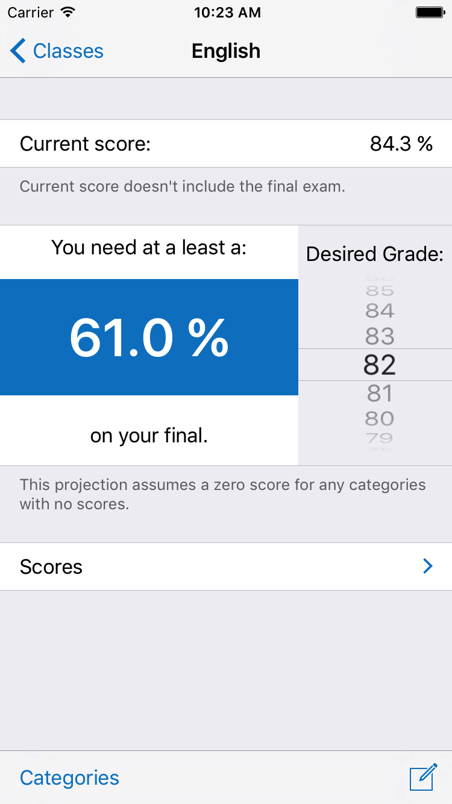
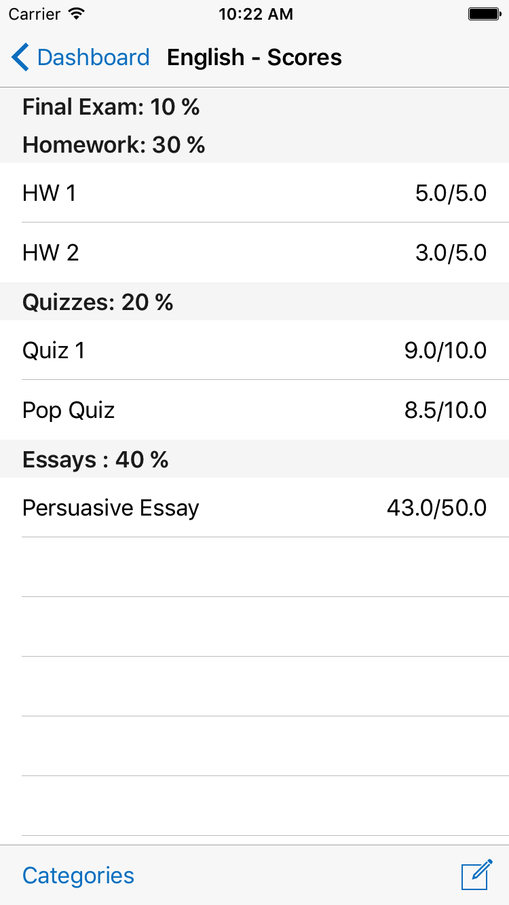

#  Features
---
Get [Final Exam on the App Store](https://itunes.apple.com/WebObjects/MZStore.woa/wa/viewSoftware?id=1229272214&mt=8).

Have you ever wondered what score you’ll need on your final exam to get the grade you want in a course? You could do the math yourself, but why not let Final Exam do it for you?

Dashboard | Add a score   | Score Summary 
:--------------------------------:|:------------------------------------:|:--------------------------------:
 | |

With Final Exam, you can keep track of multiple classes and configure each one with the weighted average your instructor is using. Then just put your scores in, pick a final grade for the course, and quickly see how well (or how poorly) your final exam needs to go. Final Exam is a simple, yet efficient app you’ll enjoy using with all your classes.

Final Exam works by using a weighted average formula. Once you select your desired final grade, Final Exam solves that formula for you and gives you the score you need on your final.